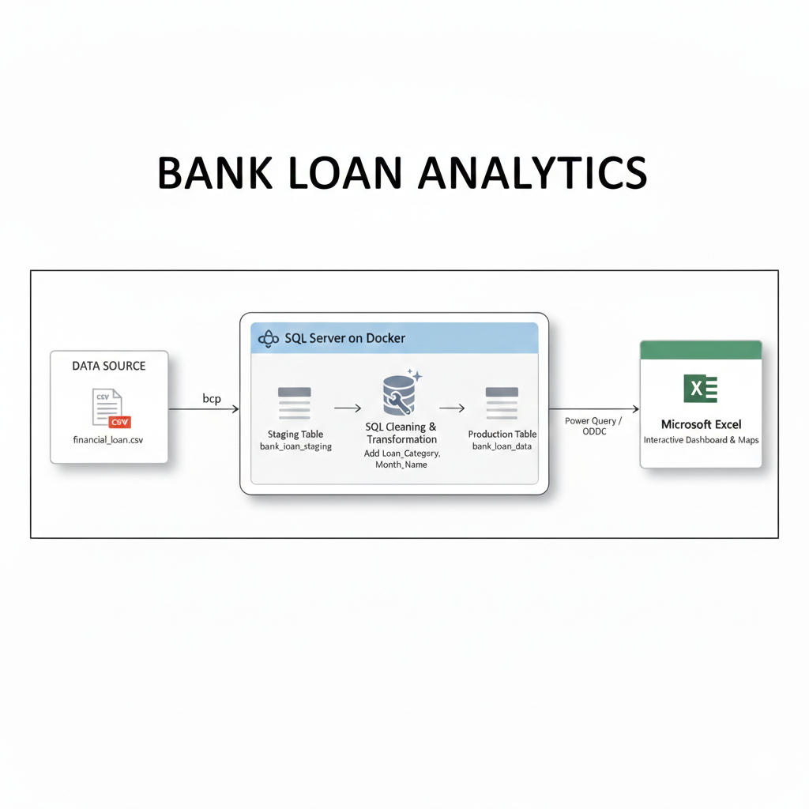
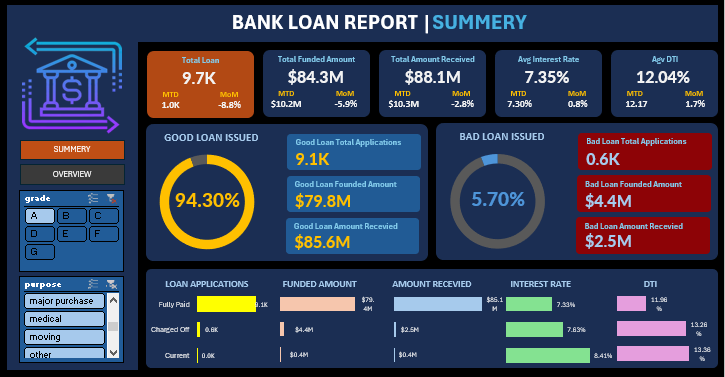
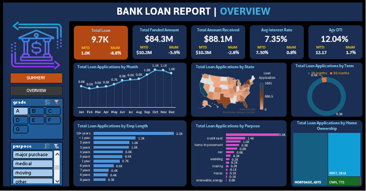

# 🏦 Bank Loan Analytics Platform
### End-to-End Data Engineering & Analytics Project

This project demonstrates a real-world end-to-end data engineering pipeline that transforms raw banking loan CSV data into clean analytical tables and professional Excel dashboards.

CSV → SQL Server (Staging) → SQL Transformation → Production Tables → Excel Dashboards

---

## 🎥 Project Walkthrough Video

A full walkthrough of the pipeline, SQL transformations, and dashboards is available here:

👉 https://drive.google.com/file/d/1xmCufSK-j7rFFhK5iALGZs5Xp58dvq7o/view?usp=sharing

## 📌 Project Idea

The goal of this project is to simulate how a Data Engineer builds a production-style analytics pipeline.

Raw financial loan data is ingested from CSV files, cleaned and transformed inside SQL Server, then consumed by Excel dashboards for business reporting.

The system enables stakeholders to understand:

- Loan performance
- Customer distribution
- Risk quality
- Financial KPIs
- Monthly trends

---

## 🛠 Tools Used

### 🐳 Docker

Used to containerize SQL Server.

Benefits:

- Portable environment
- Easy setup
- Production-like infrastructure
- No local installation issues

Docker runs SQL Server inside a container and exposes it to Excel and BCP.

---

### 🗄 Microsoft SQL Server

Acts as the Data Warehouse.

Responsibilities:

- Staging raw CSV data
- Data cleansing
- Type casting
- Business transformations
- Creating analytics-ready tables

All heavy processing happens here for performance and scalability.

---

### 📊 Microsoft Excel

Used only for visualization.

Excel connects to SQL Server using Power Query and displays dashboards using:

- Pivot Tables
- Charts
- KPI Cards
- Maps

Excel never cleans data — it only consumes final tables.

---

## 🔄 Data Pipeline & Flow



### 1️⃣ CSV Ingestion

Raw file:

financial_loan.csv

Loaded using BCP into SQL Server.

---

### 2️⃣ Staging Layer

Table:

bank_load_staging

Characteristics:

- All columns stored as NVARCHAR
- Preserves raw data
- Handles dirty values
- Accepts newlines, spaces, malformed numbers

Purpose: isolate raw data safely.

---

### 3️⃣ Transformation Layer

SQL performs:

- Remove newline characters
- Trim spaces
- TRY_CONVERT numeric values
- Convert dates
- Normalize decimals
- Apply business logic

---

### 4️⃣ Production Layer

Final table:

bank_loan_data

Contains:

- Proper INT / DECIMAL / DATE datatypes
- Clean values
- Analytics-ready schema

This table is consumed by Excel.

---

### 5️⃣ Visualization Layer

Excel connects via Power Query.

One click refresh updates everything.

---

## 📊 Dashboards

---

## ✅ Summary Dashboard



KPIs:

- Total Loan Applications
- Total Funded Amount
- Total Payment Received
- Average Interest Rate
- Average DTI

Business Metrics:

- Good Loans vs Bad Loans
- Percentage of Risky Loans
- Application Volume

Purpose:
High-level executive overview.

---

## ✅ Overview Dashboard



Analytics:

- Monthly application trends
- Loans by State (Map)
- Loans by Purpose
- Loans by Term
- Employment Length Distribution

Purpose:
Operational & demographic insights.

---

## 💡 Key Features

- Full ETL pipeline
- Dockerized SQL Server
- Staging + Production architecture
- SQL-based cleansing
- Automated Excel refresh
- Real banking KPIs
- Analytics-ready modeling

---

## 🧠 Architecture Philosophy

RAW  
↓  
STAGING  
↓  
TRANSFORMATION  
↓  
PRODUCTION  
↓  
ANALYTICS  

Excel only visualizes.  
SQL does the engineering.

---

## 🚀 How To Run

1. Start Docker:
```
docker compose up -d
```
2. Load CSV into staging:
```
bcp bank_load_staging in financial_loan.csv -c -t, -S localhost -U sa -P yourpassword
```
3. Run SQL transformation script to populate:

bank_loan_data

4. Open Excel dashboard file and click:

Data → Refresh All

---

## 🧩 Possible Future Improvements

- Data Quality layer
- Reject tables
- Indexing
- Star Schema
- Incremental loads
- Airflow orchestration
- Power BI version

---

## 👨‍💻 Developed By

Islam Hasib  
Data Engineer & Software Engineer  

Focused on building scalable data pipelines and analytics platforms.
